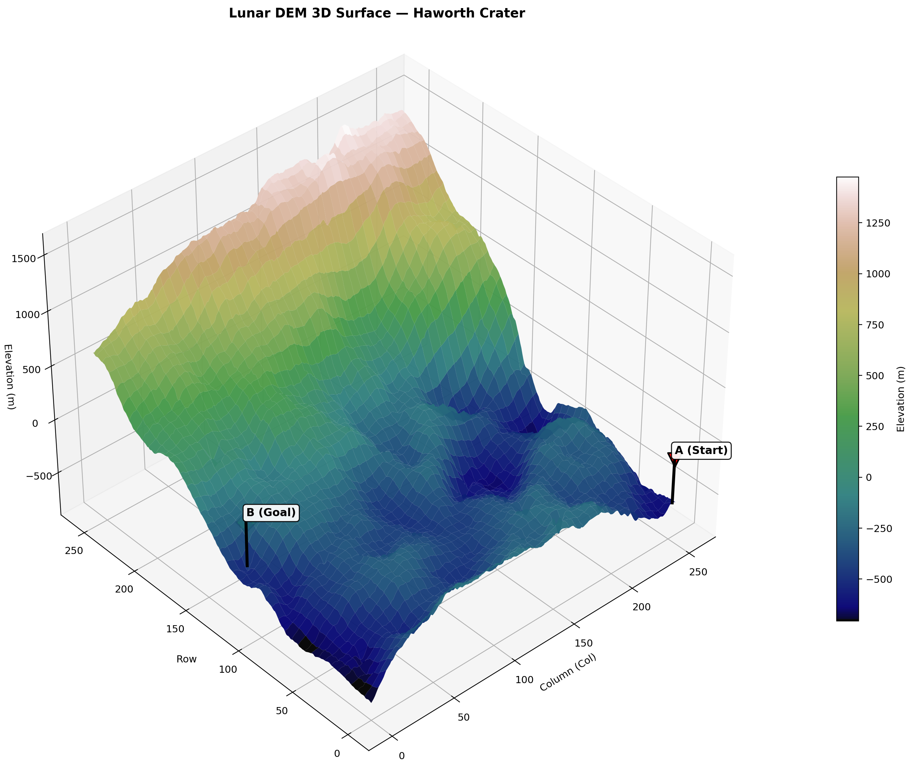
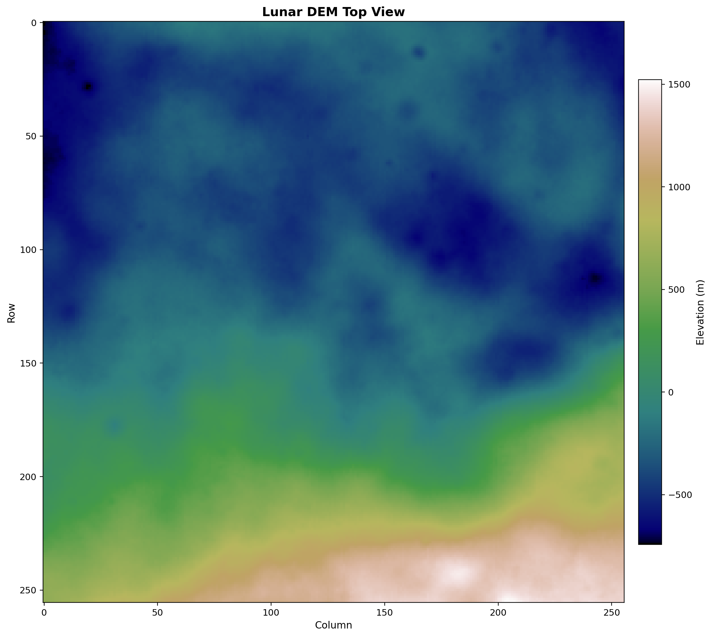
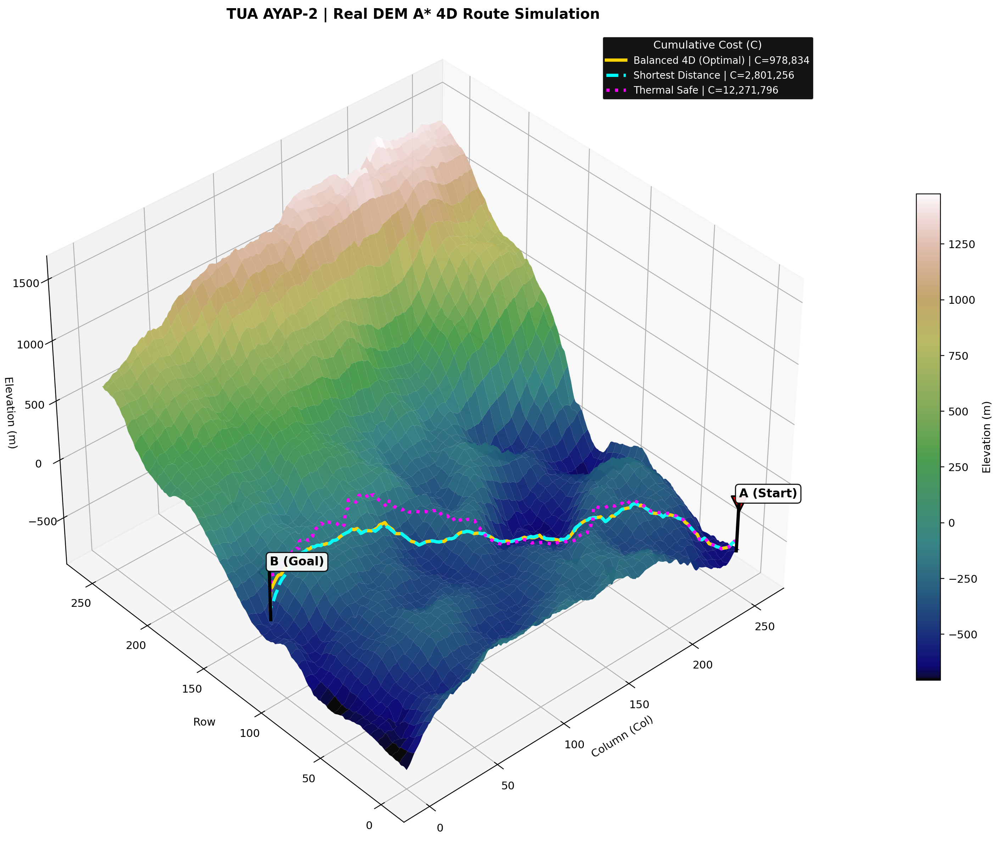

# TUA Astro Hackathon - AYAP-2 Lunar Rover Navigation System

> **4D Multi-Objective Dynamic Route Optimization for Autonomous Lunar Exploration**

A production-ready navigation pipeline for the AYAP-2 lunar rover, designed to plan safe, efficient routes across the Haworth crater using real lunar elevation data. The system balances four critical mission objectives: distance efficiency, slope traversability, surface friction, and thermal/shadow risk.

---

## Demo Output

### Input: 3D Terrain with Mission Points


### Top View: Elevation Heatmap


### Output: Optimized Route Comparison


---

## Key Features

| Feature | Description |
|---------|-------------|
| **Real Lunar DEM** | Uses actual Haworth crater elevation data (GeoTIFF), not synthetic terrain |
| **4D Cost Function** | Optimizes across distance, slope, friction, and thermal risk simultaneously |
| **3 Mission Profiles** | Balanced, Shortest Distance, and Thermal Safe routes for decision support |
| **8-Connected A*** | True grid-based pathfinding with diagonal movement support |
| **θ_max Safety** | Slopes exceeding 25° receive prohibitive cost (rover tilt limit) |
| **Dynamic SoC Mode** | Battery state-of-charge can trigger survival mode with adjusted weights |
| **Jury-Ready Output** | Generates presentation-quality PNG visualizations |

---

## 4D Cost Model

Each movement cost is computed using the AYAP-2 cost function:

```
C_total = [(W_d × D) + (W_e × E) + (W_s × S) + (W_g × G)] × 1000
```

### Cost Components

| Symbol | Component | Physical Meaning |
|--------|-----------|------------------|
| **D** | Distance | Euclidean distance between grid cells (meters) |
| **E** | Elevation/Slope | Asymmetric slope cost: steep uphill penalized, mild downhill rewarded |
| **S** | Surface | Regolith roughness and friction risk proxy |
| **G** | Shadow/Thermal | Combined hillshade + lowland depth risk for thermal management |

### Safety Constraints

- **θ_max = 25°**: Slopes exceeding this threshold receive cost = 10,000 (practical infinity)
- **Soft Shadow Avoidance**: High finite cost, not infinite walls, allowing emergency traversal
- **No Infinite Barriers**: All costs are finite to ensure path existence

---

## Mission Profiles

Three pre-configured weight profiles optimize for different mission priorities:

| Profile | W_d | W_e | W_s | W_g | Use Case |
|---------|----:|----:|----:|----:|----------|
| **Balanced 4D** | 1.40 | 4.00 | 1.60 | 0.22 | Optimal trade-off for general exploration |
| **Shortest Distance** | 9.50 | 0.25 | 0.05 | 0.01 | Time-critical or energy-limited missions |
| **Thermal Safe** | 0.90 | 1.20 | 0.50 | 6.50 | Permanently Shadowed Region (PSR) avoidance |

### Dynamic Battery Management (SoC Override)

When battery state-of-charge is provided, W_g is dynamically adjusted:

| Battery SoC | W_g Override | Mode |
|-------------|--------------|------|
| > 50% | 0.10 | Normal operation |
| 20% - 50% | 0.40 | Conservative |
| ≤ 20% | 0.80 | Survival mode |

---

## Quick Start

### Requirements

- Python 3.10+
- Core: `numpy`, `matplotlib`, `rasterio`
- Optional: `opencv-python`, `tensorflow` (for perception mode)

### Installation

```bash
# Clone and setup
git clone https://github.com/kutmur/TUA-Astro-Hackathon.git
cd TUA-Astro-Hackathon

# Create virtual environment
python3 -m venv .venv
source .venv/bin/activate

# Install dependencies
pip install --upgrade pip
pip install numpy matplotlib rasterio
```

### Run the Pipeline

```bash
# Generate all jury output files (input.png, topview.png, output.png)
python3 ayap2_nav/main.py
```

### Command Line Options

```bash
# Custom output directory
python3 ayap2_nav/main.py --output-dir ./results

# Custom DEM file
python3 ayap2_nav/main.py --tif /path/to/custom_dem.tif

# Adjust processing parameters
python3 ayap2_nav/main.py --window-size 1500 --downsample 2
```

---

## Project Structure

```
TUA-Astro-Hackathon/
├── ayap2_nav/                    # Primary navigation module
│   ├── main.py                   # Entry point - generates jury output
│   ├── config.py                 # Mission profiles, weights, thresholds
│   ├── dem_loader.py             # GeoTIFF loading + cost layer generation
│   ├── planner.py                # 8-direction A* search engine
│   ├── perception.py             # U-Net rock segmentation (optional)
│   └── visualization.py          # 3D/2D visualization generation
│
├── data/
│   └── haworth_crater_DEM_1m.tif # Real lunar DEM (256×256, ~59m/pixel)
│
├── input.png                     # Generated: 3D terrain + markers
├── topview.png                   # Generated: 2D elevation heatmap
├── output.png                    # Generated: 3D terrain + routes
│
├── requirements.txt              # Python dependencies
├── LICENSE                       # MIT License
└── README.md                     # This file
```

---

## Output Files

The pipeline generates three jury-required PNG files:

| File | Description | Resolution |
|------|-------------|------------|
| `input.png` | 3D DEM visualization with A (start) and B (goal) markers | ~2800×2400 |
| `topview.png` | 2D elevation heatmap with colorbar | ~2400×2200 |
| `output.png` | 3D DEM with all three route profiles overlaid + legend | ~2800×2400 |

---

## Perception Mode (Optional)

Camera-driven rock segmentation is disabled by default (`CAMERA_CONNECTED=False`) to avoid loading TensorFlow into memory.

To enable:

1. Edit `ayap2_nav/config.py`:
   ```python
   CAMERA_CONNECTED = True
   SEGMENTATION_MODEL_WEIGHTS = "/path/to/model.h5"
   ```

2. Install optional dependencies:
   ```bash
   pip install opencv-python tensorflow
   ```

3. Run the pipeline normally - perception will integrate with cost layers.

---

## Technical Specifications

### DEM Properties
- **Source**: Haworth crater, lunar south pole region
- **Resolution**: 256×256 pixels (~59 meters/pixel)
- **Elevation Range**: -743m to +1523m
- **CRS**: Equirectangular Moon projection
- **Data Type**: int16

### Algorithm Details
- **Pathfinding**: A* with 8-directional connectivity
- **Heuristic**: Euclidean distance (admissible)
- **Cost Scaling**: ×1000 for integer precision
- **Grid Coordinates**: UV-based (0.0-1.0) for resolution independence

### Performance
- **Typical Runtime**: ~3 seconds (256×256 grid, 3 profiles)
- **Memory**: <100MB without perception, <500MB with TensorFlow

---

## Jury Presentation Points

1. **Real Data, Real Challenges**: We use actual lunar crater topography, not synthetic terrain, ensuring our solution addresses genuine navigation challenges.

2. **Multi-Objective Optimization**: Our 4D cost function balances competing mission requirements - no single metric dominates the solution.

3. **Interpretable Alternatives**: Three distinct route profiles give mission planners clear trade-offs to choose from based on current mission state.

4. **Safety-First Design**: The 25° slope limit and soft shadow avoidance reflect real rover operational constraints.

5. **Production Ready**: Clean modular architecture, comprehensive configuration, and high-quality visualizations suitable for mission planning tools.

---

## Future Enhancements

- [ ] Hierarchical Sliding Window (50m/px global + 100×100px local window) for memory efficiency
- [ ] Real-time replanning with dynamic obstacle detection
- [ ] Integration with actual rover telemetry
- [ ] Multi-waypoint mission planning
- [ ] Terrain classification from orbital imagery

---

## Team

**ThresholdAI** — TUA Astro Hackathon 2026

- Halil Ibrahim Kutmur

---

## License

MIT License - see [LICENSE](LICENSE) file.

**Copyright (c) 2026 Halil Ibrahim Kutmur**

---

## Acknowledgments

- Turkish Space Agency (TUA) for organizing the Astro Hackathon
- NASA/LROC for lunar elevation data
- The open-source geospatial community (rasterio, GDAL)
